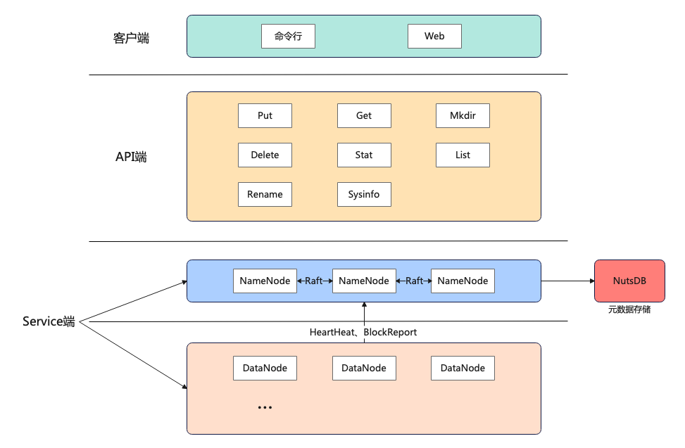
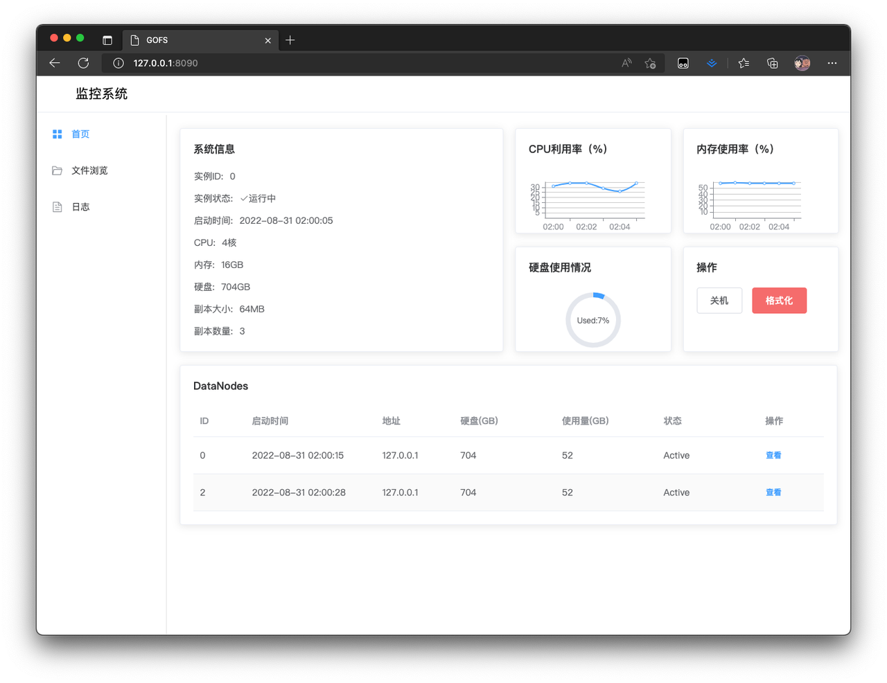

# gofs
```
  _____  ____  ______ _____    
 / ____|/ __ \|  ____/ ____|   
| |  __| |  | | |__ | (___     
| | |_ | |  | |  __| \___ \    
| |__| | |__| | |    ____) |   
 \_____|\____/|_|   |_____/    
```
[<font size=5>描述</font>](#描述)   
&emsp;[<font size=4>简要介绍</font>](#简要介绍)   
&emsp;[<font size=4>引用技术</font>](#引用技术)   
&emsp;[<font size=4>架构设计</font>](#架构设计)   
&emsp;[<font size=4>目录结构</font>](#目录结构)   
[<font size=5>安装</font>](#安装)   
[<font size=5>使用</font>](#使用)   
&emsp;[<font size=4>启动服务</font>](#启动服务)   
&emsp;[<font size=4>帮助</font>](#帮助)   
&emsp;[<font size=4>监控面板</font>](#监控面板)   
[<font size=5>性能测试</font>](#性能测试)

## 描述   
golang实现的分布式存储系统   
### 简要介绍
GOFS是由Go语言开发的简易分布式存储系统，支持常规分布式存储系统的基本文件操作   
### 引用技术
1. grpc：google.golang.org/grpc   
2. 唯一id生成器：github.com/yitter/idgenerator-go/idgen   
3. 日志打印：github.com/sirupsen/logrus   
4. 配置文件解析：github.com/BurntSushi/toml   
5. k-v数据库：github.com/xujiajun/nutsdb   
6. web框架：github.com/labstack/echo   
### 架构设计

### 目录结构
```
GOFS
├── README.md
├── config    //配置文件
│   └── config.toml
├── docs    //文档
│   └── api.md
├── logs    日志
│   └── xxxx-xx-xx.log
├── metadata    //元数据
│   └── 0.dat
├── sh    //脚本
│   ├── dn.sh
│   └── nn.sh
└── src
    ├── client    //client端
    │   ├── cmd
    │   │   ├── gofs
    │   │   └── main.go
    │   └── pkg
    │       └── api
    │           ├── delete.go
    │           ├── get.go
    │           ├── help.go
    │           ├── list.go
    │           ├── mkdir.go
    │           ├── put.go
    │           ├── rename.go
    │           ├── stat.go
    │           └── sysinfo.go
    ├── datanode    //datanode端
    │   ├── cmd
    │   │   └── main.go
    │   └── pkg
    │       ├── blockmanager    //block操作
    │       │   ├── blockscanner.go
    │       │   └── rwblock.go
    │       └── datanode
    │           ├── blockreport.go
    │           ├── clientapi.go
    │           ├── datanode.go
    │           └── keepalive.go
    ├── namenode    //namenode端
    │   ├── cmd
    │   │   └── main.go
    │   ├── pkg
    │   │   ├── leasemanager    //租约管理
    │   │   │   └── leasemanager.go
    │   │   ├── logmanager    //日志管理
    │   │   │   └── logmanager.go
    │   │   ├── metadatamanager    //元数据管理
    │   │   │   ├── metadb.go
    │   │   │   ├── metamanager.go
    │   │   │   └── operate.go
    │   │   └── namenode
    │   │       ├── clientapi.go
    │   │       ├── datanodemanager.go
    │   │       ├── loadbalance.go
    │   │       ├── monitor.go
    │   │       └── namenode.go
    │   └── static    //监控面板
    │       └── index.html
    ├── proto    //proto序列化文件
    │   ├── datanode.proto
    │   ├── namenode.proto
    │   ├── statuscode.proto
    │   └── struct.proto
    └── service    //grpc文件
        ├── datanode.pb.go
        ├── datanode_grpc.pb.go
        ├── namenode.pb.go
        ├── namenode_grpc.pb.go
        ├── statuscode.pb.go
        └── struct.pb.go
```
### 监控面板

## 安装
```bash
$ git clone https://github.com/baytan0720/gofs.git
```
## 使用
### 配置文件
config/config.toml   
### 启动服务
```Bash
cd sh && sh nn.sh
cd sh && sh dn.sh
```
### 帮助
```Bash
cd src/client/cmd && go build -o gofs main.go
./main help
```
```
Usage of gofs <command>:
  gofs help     'get usage of gofs'
  gofs sysinfo  'get system stat'

  gofs ls <gofspath>    'get file list on path'
  gofs del <gofspath>   'delete file on gofs'
  gofs stat <gofspath>  'get file stat'
  gofs rename <gofspath>        'rename file or directory'
  gofs put <gofspath> <localpath>       'put file to gofs'
  gofs get <gofspath> <localpath>       'get file to local'
  gofs mkdir <gofspath> <dirname>       'make directory on path'
```
### 监控面板
浏览器访问127.0.0.1:8090   
## 性能测试

## 目前存在问题
1. 未利用分布式共识算法实现元数据多节点   
2. DataNode负载均衡(Rebalance)未实现，仅支持在写入时负载均衡，不支持将高负载的Block迁移到低负载的服务器   